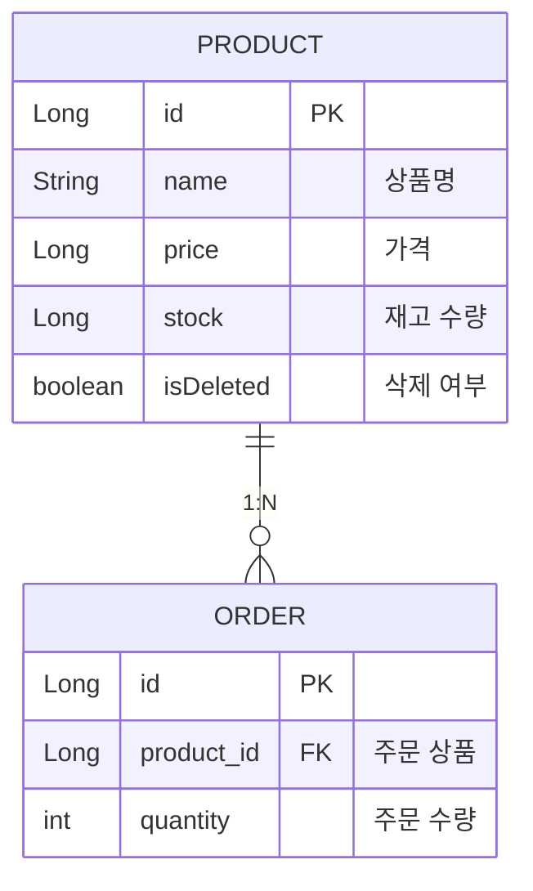

# 🛒 주문 관리 시스템 (Spring Boot 미니 프로젝트)

## 1. 프로젝트 소개
Spring Boot를 활용하여 상품과 주문을 관리하는 작은 API 서버를 만들었습니다.
내일배움캠프 과제 가이드에 제시된 기본/도전 과제를 모두 구현했으며, 추가로 에러 처리와 API 문서화(Swagger)를 적용해 보며 백엔드의 전체적인 흐름을 이해하려고 노력했습니다.

## 2. 개발 환경
- **Language:** Java 17
- **Framework:** Spring Boot 4.0.5, Spring Data JPA
- **Database:** MySQL
- **Build Tool:** Gradle

## 3. 핵심 도메인 및 연관 관계 설계 (ERD)

상품 엔티티와 주문 엔티티를 1:N 이라는 외래키(FK) 관계로 묶어, 상품의 이름이 바뀌면 주문 조회 시점에서도 항상 최신 이름이 출력되도록 설계했습니다.



## 4. 핵심 요구사항 실행 증빙 (스크린샷)

### 📸 핵심 1: 주문 목록 조회 (N+1 방어 및 페이징)
<!-- 여기에 [주문 목록 조회] 스크린샷 1장을 드래그 앤 드롭으로 넣어주세요! -->
> **설명:** 여러 건의 주문을 조회할 때, N+1 쿼리 최적화(Fetch Join)를 통해 안정적으로 주문과 상품 정보를 함께 불러오는 결과입니다.

<br>

### 📸 핵심 2: 상품 재고 차감 및 동시성 예외 방어
<!-- 여기에 [재고 1인 상품 2번 주문 실패] 스크린샷 1장을 드래그 앤 드롭으로 넣어주세요! -->
> **설명:** 재고가 1개인 상품을 2번 연속 주문했을 때, 수량이 0 미만으로 떨어지지 않고 방어되어 주문 생성이 거부되는 결과입니다.

---

## 5. 과제 구현 내용

### 🧩 필수 과제
- [x] **상품 CRUD 기능**
  - 상품 등록, 단건/목록 조회, 수정, 삭제 기능을 구현했습니다.
  - **상품 삭제 방식 (Soft Delete):** DB에서 데이터를 직접 지우지 않고 `is_deleted` 상태 값만 변경하는 논리적 삭제 방식을 적용했습니다. 주문 내역 같은 기록성 데이터가 깨지는 것을 사전에 방지하기 위해 이렇게 설계했습니다.
- [x] **주문 기능**
  - 등록된 상품 ID를 바탕으로 주문할 수 있게 구현했습니다.
  - 주문 조회 시 해당하는 상품명을 같이 가져올 수 있도록 연관관계를 매핑했습니다.

### 🚀 도전 과제
- [x] **주문 목록 조회 및 N+1 문제 해결**
  - 여러 개의 주문 데이터를 나누어 불러올 수 있도록 `Pageable`을 활용해 페이지네이션을 지정했습니다.
  - N+1 문제가 발생하는 현상을 방지하기 위해 **Fetch Join**을 적용하여 쿼리 한 번으로 연관된 상품 정보까지 불러오도록 최적화했습니다.
- [x] **재고 차감 로직 및 동시성(원자성) 고민**
  - 주문 시 해당 상품의 재고(Stock) 필드가 차감되도록 구현했습니다.
  - 조건문을 통해 재고가 부족할 경우 0 미만으로 내려가지 않도록 예외 처리를 추가했습니다.
  - 추가로 여러 명이 동시에 주문할 때 재고가 꼬일 수 있는 동시성 이슈를 고민해 보았고, DB의 **비관적 락(Pessimistic Lock)** 개념을 학습하여 재고가 최대한 안전하게(Atomic) 차감될 수 있도록 적용해 보았습니다.

## 6. 추가로 공부하고 적용해 본 내용 (Troubleshooting)

필수 과제를 마무리하고 코드를 정리하면서, 두 가지 아쉬운 점을 찾아 수정해 보았습니다.

1. **전역 예외 처리 (Global Exception Handler) 도입**
   - 초기엔 재고 부족이나 삭제된 상품 조회 시 단순히 서버 측 `IllegalArgumentException`만 뿜어냈습니다. 향후 클라이언트(프론트엔드)가 에러 처리를 쉽게 하려면 상태 코드를 나눠야 한다고 판단하여 컨트롤러 밖에서 에러를 모으는 `@RestControllerAdvice`를 사용했습니다.
   - 도메인 전용 예외 클래스(`ProductNotFoundException` 등)를 직접 만들고, 각각 404, 409 등의 상태 코드와 에러 내용을 일관된 JSON 형식으로 내려주도록 변경했습니다.

2. **Swagger(springdoc) 연동과 라이브러리 충돌 해결**
   - 개발 편의를 위해 API 명세를 자동으로 만들어주는 Swagger를 적용해 보려 했습니다. 그러나 처음 설정 시 `NoSuchMethodError`와 `NoProviderFoundException` 등이 번갈아 뜨며 실행 단계에서 멈추는 에러를 겪었습니다.
   - 공식 문서 등을 확인해보니 현재 적용된 Spring Boot 4.x 버전과 스웨거(2.x 버전)의 호환성 문제임을 알게 되었습니다. 버전을 `3.0.2`로 직접 맞추고 누락된 `spring-boot-starter-validation` 라이브러리를 보강해 스프링 부트 런타임 호환성 문제를 해결했습니다.

## 6. DB 설정 및 실행 방법 (How to Run)

본 프로젝트는 MySQL을 기본 데이터베이스로 사용합니다. 프로젝트를 처음 실행하기 전, PC 환경에 맞게 DB 연결 설정이 필요합니다.

### 1단계: Database 생성
MySQL 에 접속하여 전용 데이터베이스를 생성합니다.
```sql
CREATE DATABASE order_system;
```

### 2단계: application.yml 수정 (DB 계정 연동)
`src/main/resources/application.yml` (또는 properties) 파일에서 본인의 MySQL 계정 정보에 맞게 아이디와 비밀번호를 수정해 주세요.
```yaml
spring:
  datasource:
    url: jdbc:mysql://localhost:3306/order_system
    username: root        # 본인의 MySQL 아이디로 변경 (예: root)
    password: password123 # 본인의 MySQL 비밀번호로 변경
```

### 3단계: 빌드 및 실행
```bash
# 프로젝트 빌드 및 실행
./gradlew bootRun
```
- 서버 구동 후 브라우저에 접속하여 자동으로 생성된 API 명세서(Swagger UI)를 확인할 수 있습니다: `http://localhost:8080/swagger-ui/index.html`

<br>

## 8. 개발 과정 및 TIL (블로그)
프로젝트를 진행하며 부딪힌 문제들, 개념 학습, 그리고 트러블슈팅 과정을 개인 블로그에 상세히 기록했습니다.

- [🔗 Spring Boot 프로젝트 초기 설정 및 DB 연동](https://k-r-1.tistory.com/120)
- [🔗 Spring Boot 상품 관리 CRUD API 구현 및 Soft Delete 리팩토링](https://k-r-1.tistory.com/121)
- [🔗 Spring Boot 주문 시스템 API 구현](https://k-r-1.tistory.com/124)
- [🔗 Spring Boot 주문 API - 상품 재고 차감과 동시성 문제(비관적 락) 해결](https://k-r-1.tistory.com/125)
- [🔗 JPA N+1 문제 해결과 페이징 최적화 (Fetch Join & Lazy Loading)](https://k-r-1.tistory.com/126)
- [🔗 Spring Boot 전역 예외 처리(Global Exception Handler)와 커스텀 예외 적용](https://k-r-1.tistory.com/127)
